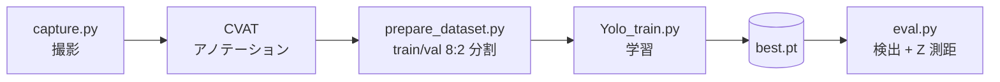

# Tumor Detector

**YOLOv8 × Intel RealSense による腫瘍ファントムの検出と Z 座標測距**

自動触診ロボットのアーム制御に向けて、深度カメラ（RealSense）の映像から YOLO で腫瘍ファントムを検出し、
**カメラから鉛直下向きの距離（Z 座標）** をリアルタイムに測定します。

<!-- 実際の計測画面（Phantom / dx, dy / Z(vert) が表示されている画像）を docs/demo.png に置いてください -->
<p align="center">
  


</p>

---

## 処理の流れ




---

## 1. 学習

| 項目 | 設定 |
| --- | --- |
| モデル | YOLOv8n（COCO 事前学習済み） |
| データ | 自分で撮影した 200 枚（学習 160 / 評価 40）、1 クラス（ファントム） |
| 学習 | 100 epoch / 画像サイズ 640 / バッチ 16 |

```python
model = YOLO('yolov8n.pt')
model.train(data='dataset.yaml', epochs=100, imgsz=640)
```

**結果**（`runs/detect/train-8`、最終 epoch）

| Precision | Recall | mAP@50 | mAP@50-95 |
| :---: | :---: | :---: | :---: |
| 0.952 | 0.997 | **0.993** | 0.617 |

<p align="center">
  
</p>

---

## 2. Z 座標の測定（`eval.py`）

カメラは斜め下向きに設置しているため、カメラ方向の深さをそのまま使うのではなく、角度を考慮して鉛直方向の距離に変換します。

<!-- スライドの測距図（θ, D, dy の関係）を docs/ranging.png に置いてください -->
<p align="center">
  

</p>

| 記号 | 意味 |
| --- | --- |
| θ | カメラ方向と鉛直方向のなす角（`CAMERA_ANGLE_DEG`） |
| D | カメラ方向の距離（深さ） |
| dy | 画像中心からファントムまでの縦方向のズレ |

$$
Z = D \cos\theta + dy \sin\theta
$$

1. **深度の取得**：`rs.align` で深度をカラー画像に位置合わせし、bbox 中心周辺 5×5 ピクセルの有効深度を平均（ノイズ・欠損対策）
2. **カメラ座標へ変換**：`rs2_deproject_pixel_to_point` で D と dy を実寸で取得
3. **Z を計算**：上式で鉛直方向の距離に変換して表示

> dx, dy は Z を求めるための画像中心からのズレで、ロボット座標系での X, Y はまだ取得できていません。

### 精度

Z 約 40〜50 cm の範囲で 5 箇所を測定し、**θ を正確に合わせれば ±5 mm 以下** で測距できることを確認しました。

---

## 動作環境

- Intel RealSense（カラー / 深度とも 640×480, 30fps）
- Python + `ultralytics`, `pyrealsense2`, `opencv-python`, `numpy`

```bash
pip install ultralytics pyrealsense2 opencv-python numpy
python eval.py   # q キーで終了
```

> スクリプト内のパス（`dataset.yaml`, `best.pt`）と `CAMERA_ANGLE_DEG` は環境に合わせて書き換えてください。

## 今後

AR マーカーでロボットとカメラの座標系を統一し、X, Y 座標も取得してロボットアームと連動させる予定です。
