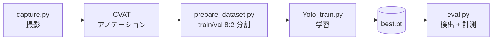
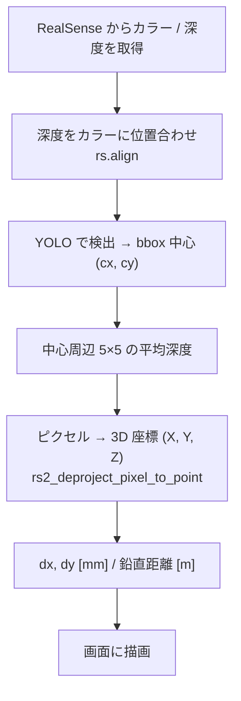
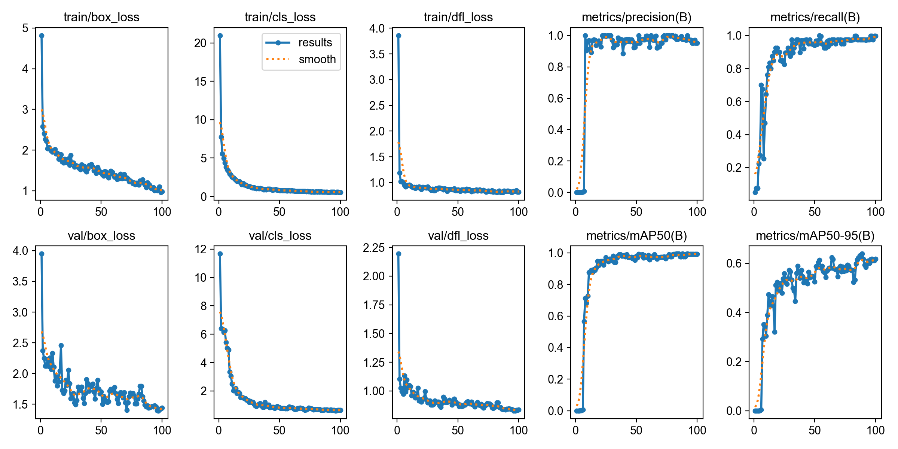

# Tumor Detector

**YOLOv8 × Intel RealSense による腫瘍ファントムの検出と 3D 位置計測**

RGB-D カメラ（RealSense）の映像から YOLO で腫瘍ファントムを検出し、深度情報と組み合わせて
**カメラ光軸からのズレ（mm）** と **鉛直方向の距離（m）** をリアルタイムに表示します。

<!-- 座標を表示している実機画面のスクリーンショットを docs/demo.png に置いてください -->
<p align="center">
  
</p>

---

## 処理の流れ



`eval.py` の 1 フレームあたりの処理：



---

## 1. 学習

| 項目 | 設定 |
| --- | --- |
| モデル | YOLOv8n（COCO 事前学習済み） |
| データ | 自分で撮影した 200 枚（train 160 / val 40）、1 クラス（ファントム） |
| 学習 | 100 epoch / 画像サイズ 640 / バッチ 16 |

```python
model = YOLO('yolov8n.pt')
model.train(data='dataset.yaml', epochs=100, imgsz=640)
```

**結果**（`runs/detect/train-8`、最終 epoch）

| Precision | Recall | mAP@50 | mAP@50-95 |
| :---: | :---: | :---: | :---: |
| 0.952 | 0.997 | **0.993** | 0.617 |

<p align="center">
  
</p>

---

## 2. 測定（`eval.py`）

### ① 深度の取得
`rs.align` で深度フレームをカラーフレームに位置合わせし、bbox 中心 `(cx, cy)` 周辺 **5×5 ピクセルの有効深度を平均**します。
1 点だけ読むよりノイズや欠損（深度 0）に強くなります。

### ② 光軸からのズレ
`rs2_deproject_pixel_to_point` で、ピクセル座標と深度をカメラ内部パラメータを使って 3D 座標 `(X, Y, Z)` [m] に変換します。

- **dx, dy [mm]** = `X × 1000`, `Y × 1000`（画面中央の赤い十字 ＝ 光軸が原点）

### ③ 鉛直方向の距離
カメラは斜めに設置しているため、光軸と鉛直下向きのなす角 θ（`CAMERA_ANGLE_DEG`、実験では 49°）でカメラ座標を回転し、鉛直成分を求めます。

$$
Z_{\text{vert}} = Y \sin\theta + Z \cos\theta
$$

---

## 動作環境

- Intel RealSense（カラー / 深度とも 640×480, 30fps）
- Python + `ultralytics`, `pyrealsense2`, `opencv-python`, `numpy`

```bash
pip install ultralytics pyrealsense2 opencv-python numpy
python eval.py   # q キーで終了
```

> スクリプト内のパス（`dataset.yaml`, `best.pt`）は環境に合わせて書き換えてください。
